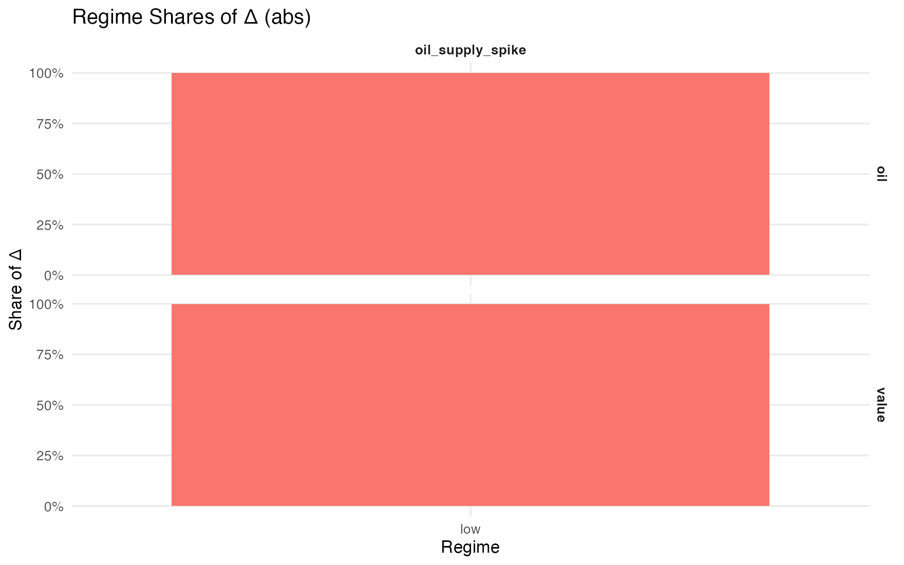
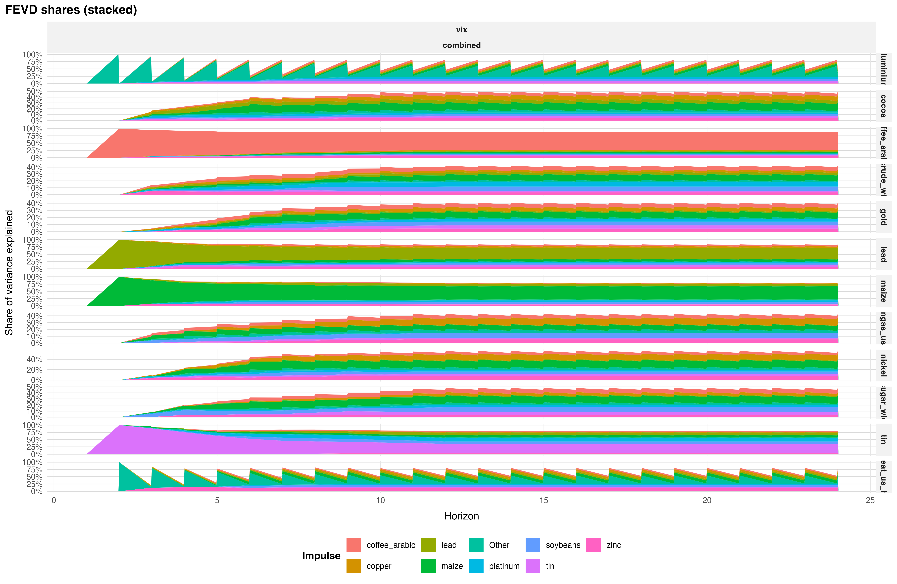

# The Nonlinear Effects of Macroeconomic Uncertainty on Commodity Price Returns

### A Replication and Extension of Joëts & Mignon (2016)

This project builds a nonlinear macro-financial framework to study how **macroeconomic uncertainty** shapes shock transmission to **commodity returns** across economic regimes. It replicates and extends **Joëts & Mignon (2016)** using a two-regime **Threshold VAR (TVAR)** estimated on **18 monthly commodities** (energy, industrial metals, precious metals, agriculture) over **1986–2025**.

Regimes are defined by two conceptually distinct uncertainty proxies, a **volatility-based** measure (VXO→VIX) and a **macro-predictability** measure (JLN) — enabling a direct comparison of how proxy choice shapes identified transmission dynamics. **Generalized Impulse Response Functions (GIRFs)** and **state-contingent Forecast-Error Variance Decompositions (FEVDs)** quantify amplification and persistence in high-uncertainty states and benchmark them against linear VAR/SVAR counterfactuals.

The pipeline is fully modular and reproducible: frozen R 4.4.3 via `renv`, scripted data ingestion, deterministic seeds, and automated figure/table exports.

---

## Academic Context

This paper was submitted in August 2025 as a term paper for the seminar **REDACTED** at the **REDACTED** (REDACTED), supervised by REDACTED.

**[Read the full term paper (PDF)](https://github.com/simonochmann/Nonlinear_SVAR_Uncertainty_Commodities/blob/main/paper/Ochmann_NonlinearSVAR.pdf)**

---

## Research Questions

The analysis is organized around three research questions:

1. Does the original state-contingent amplification result of Joëts & Mignon (2016) replicate on the 1986–2015 window?
2. How do findings change when the sample is extended through June 2025, incorporating COVID-19 and the 2022–24 tightening cycle?
3. To what extent does proxy choice — volatility-based (VXO/VIX) vs. macro-predictability-based (JLN) — alter regime identification and the measured size and persistence of spillovers?

---

## Modeling Framework

| Component | Details |
|---|---|
| **Model** | Two-regime Threshold VAR (TVAR) |
| **Regime driver** | 3-month moving average of z-standardized proxy, lagged 1 month |
| **Threshold selection** | Pooled BIC on a 15–85% trimmed grid; companion eigenvalues < 1 enforced |
| **Uncertainty proxies** | Volatility: VXO (1986–1989) spliced to VIX (1990–2025); Macro-predictability: JLN index |
| **Impulse responses** | Order-invariant GIRFs normalized by regime-specific innovation s.d. (Koop, Pesaran & Potter 1996) |
| **Variance decomposition** | State-contingent GFEVD constructed from GIRFs (Pesaran & Shin 1998) |
| **Inference** | Regime-aware residual bootstrap |
| **Linear benchmarks** | Pooled VAR and recursive SVAR (proxy ordered last) as state-invariant counterfactuals |
| **Reproducibility** | Frozen R 4.4.3 via `renv`, scripted ingestion, pinned seeds, automated exports |

---

## Data Sources

Processed data inputs are committed to the repository. All series are freely available; ingestion is fully scripted.

| Series | Source | Access | Ingestion script |
|---|---|---|---|
| 18 commodity prices (monthly, 1986–2025) | World Bank Pink Sheet | Free | `00_parse_pink_sheet.R` |
| VIX (CBOE S&P500 Volatility Index) | FRED: `VIXCLS` | Free | `00_parse_fred_data.R` |
| VXO (CBOE S&P100 Volatility Index) | FRED: `VXOCLS` | Free | `00_parse_fred_data.R` |
| JLN Macroeconomic Uncertainty Index | Jurado, Ludvigson & Ng (2015) via FRED: `JLNUM1M` | Free | `02_merge_uncertainty_index.R` |

The commodity panel covers 18 benchmarks: Crude oil (WTI), Natural gas, Aluminium, Copper, Lead, Nickel, Tin, Zinc, Gold, Platinum, Silver, Cocoa, Coffee (Arabica), Cotton, Maize, Soybeans, Sugar, and Wheat — each with 1,327 monthly observations (1986–2025).

---

## Reproducing the Results

```r
# 1. Restore the frozen R 4.4.3 environment
renv::restore()

# 2. Run the full pipeline end-to-end
source("scripts/run_all.R")
```

All outputs — figures, CSVs, tables — are written to `figures/` and `output/`. See `scripts/12_export_run_info.R` for the session info and seed log. Each script in the pipeline is self-contained and can be sourced individually for targeted runs.

---

## Key Results

### Regime shares under VXO and JLN
High-uncertainty incidence is **~16%** under the Volatility proxy and **~15%** under JLN. Jaccard overlap between the two partitions is **J = 0.269**, confirming that the proxies encode meaningfully different information sets.



### Linear vs. TVAR uplifts in the high-uncertainty regime

TVAR high-regime peaks exceed linear VAR responses across all commodity groups:

| Proxy | Group | Peak ratio (×) | Δ half-life (months) |
|---|---|---|---|
| JLN | Energy | 3.58 | −0.11 |
| JLN | Industrial | 1.70 | 0.00 |
| JLN | Precious | 1.78 | +0.03 |
| JLN | Agriculture | 1.75 | +0.13 |
| Volatility (VXO/VIX) | Energy | 2.36 | −0.18 |
| Volatility (VXO/VIX) | Industrial | 1.04 | −0.04 |
| Volatility (VXO/VIX) | Precious | 1.16 | −0.07 |
| Volatility (VXO/VIX) | Agriculture | 1.32 | +0.12 |

### State-contingent Variance Decomposition (GFEVD)


In high-uncertainty states, forecast-variance shares shift toward **Energy** and away from **Industrial** under the Volatility proxy. Under JLN the shift is partly reversed, illustrating the proxy wedge.

---

## Project Structure

```
.
├── scripts/                   # Estimation and analysis pipeline
├── data/                      # Processed inputs (generated by ingestion scripts)
├── figures/                   # All exported figures
│   └── decomposition/         # FEVD stacks, waterfalls, Δ-lines
├── output/                    # Tables and CSV artifacts
├── paper/                     # Term paper PDF
├── renv/                      # Frozen R environment
└── renv.lock                  # Dependency lockfile (R 4.4.3)
```

### Core Analysis Pipeline

| Script | Purpose |
|---|---|
| `00_parse_pink_sheet.R` | Parse & validate World Bank Pink Sheet commodity panel; export tidy inputs |
| `01_filter_commodity_panel.R` | Build balanced monthly panel, returns (100 × Δlog P), group labels, coverage checks |
| `02_merge_uncertainty_index.R` | Load/clean VXO/VIX and JLN; standardize, smooth (MA(3)), lag (1m); export regime driver |
| `03_prepare_panel_for_tvar.R` | Build modeling matrices; threshold grid (15–85%); seed control; config snapshot |
| `04_estimate_tvar.R` | Estimate TVAR by regime; select (p, delay, threshold) via pooled BIC; stability & residual diagnostics |
| `05_analyze_tvar_model.R` | Compute GIRFs, state-contingent GFEVD, contributions; export figures/CSVs |
| `06_analyze_regime_dynamics.R` | Summarize regime paths, shares, durations; export timelines & diagnostics |

### Scenario Analysis and Decomposition

| Script | Purpose |
|---|---|
| `07_shock_scenario_simulations.R` | Scenario engine using TVAR-GIRFs (stress paths, horizon-specific views) |
| `08_forecast_decomposition.R` | Decompose Δ = shocked − baseline; FEVD-from-GIRFs; exports + logs |

### Exports and Paper Artifacts

| Script | Purpose |
|---|---|
| `06_export_table2_artifacts.R` | Table 2: linear vs. TVAR uplifts (peak ratio, Δ half-life) |
| `07_export_table3_uplifts.R` | Table 3: proxy wedges by commodity group |
| `08_export_appendix_commodities_table.R` | Appendix: commodity panel coverage table |
| `09_package_and_export.R` | Bundle figures, CSVs, and paper assets for distribution |
| `11_export_table4_robustness.R` | Table 4: robustness matrix (lags, delay, threshold trim) |
| `12_export_run_info.R` | Session info, seeds, config snapshot for full reproducibility |

### Orchestration and Setup

| Script | Purpose |
|---|---|
| `run_all.R` | One-command end-to-end run: parse → estimate → analyze → export |
| `run_07_all_indices.R` | Batch scenario runs across indices and proxies |
| `setup.R` | Load packages, set global options, confirm environment |

---

## References

- Joëts, M., & Mignon, V. (2016). Does the Volatility of Commodity Prices Reflect Macroeconomic Uncertainty? *SSRN Electronic Journal*. 
- Jurado, K., Ludvigson, S. C., & Ng, S. (2015). Measuring Uncertainty. *American Economic Review*, 105(3), 1177–1216.
- Koop, G., Pesaran, M. H., & Potter, S. M. (1996). Impulse response analysis in nonlinear multivariate models. *Journal of Econometrics*, 74(1), 119–147.
- Pesaran, M. H., & Shin, Y. (1998). Generalized impulse response analysis in linear multivariate models. *Economics Letters*, 58(1), 17–29.
- Kilian, L., & Lütkepohl, H. (2017). *Structural Vector Autoregressive Analysis* (1st ed.). Cambridge University Press.
- Lütkepohl, H. (2005). *New Introduction to Multiple Time Series Analysis*. Springer.
- Stock, J. H., & Watson, M. W. (2001). Vector Autoregressions. *Journal of Economic Perspectives*, 15(4), 101–115.
- Tong, H. (1990). *Non-linear Time Series: A Dynamical System Approach*. Oxford University Press.
- Tsay, R. S. (1998). Testing and Modeling Multivariate Threshold Models. *Journal of the American Statistical Association*, 93(443), 1188–1202.

---

## Author

**Simon Ochmann** · [github.com/simonochmann](https://github.com/simonochmann)

---

## License

This project is licensed under the [MIT License](LICENSE).
